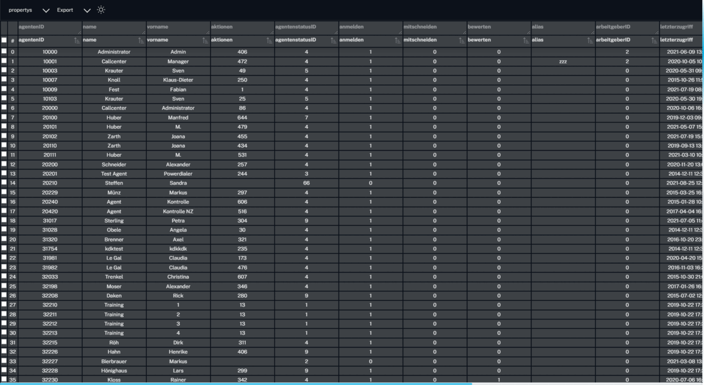

<div align="center">

<h1 align="center">
  🚧Creating Dynamic Table with knockoutJs🚧
</h1>

Data in the form of several Json files are read in and prepared for display (listing).

<br>

<br>
<h3 align="left">DataTable:</h3>

<h3 align="left">DataTable Sub:</h3>

<h3 align="left">DataTable Form:</h3>

</div>

## Table of Contents

-   [Aufgabe der Seite](#aufgabe-der-seite)
-   [Übersicht](#-bersicht)
-   [ViewModel](#viewmodel)

---

<h2 style="color:red">
If you don't have a server, you can use my NodeJs Express server to connect to the database
</h2><a href="http://gssdlxdev01:8888/am/server-for-datatable">Nodejs Express server</a>

---

## Task of the code

Create table

The data is to be presented in the form of a list, and the table is to provide the following functions:

-   filter
-   sort
-   form column

## Overview

The table is realized (implemented, shown) knockout with the View Model ModelView pattern

```tree
├── 📁clt
│   ├── 📁css
│   │   └── 📄 app.css
│   └── 📁js
│       ├── applyBindings.js
│       ├── 📁dist
│       │   ├── 📄 aktionen.class.js  View Model
│       │   └── 📄 createTable.class.js
│       └── 📁json
│           ├── 📄 agenten.json
│           ├── 📄 agentenstatus.json
│           ├── 📄 aktionen.json
│           ├── 📄 aktionsagenten.json
│           └── 📄 produkte.json
├── 📄 header.php
├── 📄 pgreq.php
├── 📄 README.md
└── 📄 req.php
```

The data must look like the following when you fetch the data from Databank

```sql
BEGIN

	declare v_result longtext default '';
	declare v_agenten longtext;

	set v_agenten = (
							SELECT
CONCAT('['
		  		, group_concat(
					JSON_OBJECT(
						'agentenID', JSON_OBJECT('value', agentenID, 'key', concat('spf_TableFormFuerAland(',agenten.agentenID, ')')),
					   'name', JSON_OBJECT('value', name, 'key', concat('spf_TableFormFuerAland(',agenten.agentenID, ')')),
					   'vorname', JSON_OBJECT('value', vorname, 'key', 'false'),
					   'aktionen', JSON_OBJECT('value', spf_AgentAnzahlAktion(agentenID, 1) collate latin1_general_ci, 'key', concat('getAktionen(',agentenID, ')')),
					   'agentenstatusID', JSON_OBJECT('value', agentenstatusID, 'key', 'false'),
					   'anmelden', JSON_OBJECT('value', anmelden, 'key', 'false'),
					   'mitschneiden', JSON_OBJECT('value', mitschneiden, 'key', 'false'),
					   'bewerten', JSON_OBJECT('value', bewerten, 'key', 'false'),
					   'alias', JSON_OBJECT('value', alias, 'key', 'false'),
					   'arbeitgeberID', JSON_OBJECT('value', arbeitgeberID, 'key', 'false'),
					   'letzterzugriff', JSON_OBJECT('value', letzterzugriff, 'key', 'false'),
					   'agentenpositionsID', JSON_OBJECT('value', agenten.agentenpositionsID, 'key', concat('getPosition(', agentenID, ')')),
					   'agentenposition', agentenposition.bezeichnung,
					   'bilddatenID', JSON_OBJECT('value', bilddatenID, 'key', 'false'),
					   'einloggen', JSON_OBJECT('value', einloggen, 'key', 'false'),
					   'mitschnittmodusID', JSON_OBJECT('value', mitschnittmodusID, 'key', 'false')

					)
				  )
				, ']')

		FROM agenten
		inner join agentenposition on agentenposition.agentenpositionsID = agenten.agentenpositionsID


		where agenten.agentenstatusID <> 6


	);

	set v_result = (select json_object(
		'table', JSON_extract(v_agenten, '$') //! You must decide whether you have a table or tableSub or tableForm
		));
return v_result;
END
```

Or that Json data should look like this :

```json
{
	"Table": [
		{
			"agentenID": {
				"value": 3,
				"key": "agentenID"
			},
			"name": {
				"value": "Training",
				"key": "agentenID"
			},
			"vorname": {
				"value": "1",
				"key": "agentenID"
			},
			"agentenstatusID": {
				"value": 1,
				"key": "agentenID"
			},
			"anmelden": {
				"value": 1,
				"key": "agentenID"
			},
			"mitschneiden": {
				"value": 0,
				"key": "agentenID"
			},
			"bewerten": {
				"value": 0,
				"key": "agentenID"
			},
			"alias": {
				"value": "",
				"key": "agentenID"
			},
			"arbeitgeberID": {
				"value": 0,
				"key": "agentenID"
			},
			"letzterzugriff": {
				"value": "2019-10-22 17:24:09",
				"key": "agentenID"
			},
			"agentenpositionsID": {
				"value": 30,
				"key": "agentenID"
			},
			"agentenposition": "Agent",
			"bilddatenID": {
				"value": null,
				"key": "agentenID"
			},
			"einloggen": {
				"value": 0,
				"key": "agentenID"
			},
			"mitschnittmodusID": {
				"value": 1,
				"key": "agentenID"
			}
		}
	]
}
```

## `tableVM.class.js`:

class aktionenVM realisiert das ViewModel

### variable:

-   `self.nodes` : An observableArray that is used to store the data.
-   `self.columns`: contains the column headers to be displayed (composed of title, sorting, input filte for search).
-   `self.rows` : enthölt die anzuzeigenen Splaten-body (bestet aus data) and Used to limit the amount of times the rows are updated
-   `self.isLoading` : A boolean value that is used to show or hide the loading animation.
-   `self.selectedPropertys` : An observableArray that is used to store the selected properties.

### Function:

-   `self.getProperty`: return unique list (`one object`) of properties
-   `self.getAgenten` : returns unique list (`one object`) of agenten properties
-   `self.getAgentenStatus` : returns unique list (`one object`) of AgentenStatus Properties
-   `self.getAktionen` : returns unique list (`one object`) of Aktionen Properties
-   `self.getAktionenagenten` : returns unique list (`one object`) of Aktionenagenten Properties
-   `self.getProdukte` : returns unique list (`one object`) of Produkte Properties
-   `self.selectedAllPropertys` : A computed observable that is called when the selectedPropertys changes. it setting all selectedAllPropertys of True
-   `init` : A function that is called when the data is loaded.
-   `self.createTable` : Creating a new instance of the createTable class. und werde Rows, Columns, updateRows, rowsLength, isLoading übergeben
-   `self.updateRows` : A function that is called when the rows are updated.
-   `self.getJson` : A function that is used to load the json files.

## `createTable.class.js`:

view für die dagestellte tabelle und werde die daten bearbeitet, sortiert, gefiltet.

### variable:

-   `self.updateRows` : Used to update the rows in the table. why dont used observable besause it's a callback Function // TODO
-   `self.isLoading` : A boolean value that is used to show or hide the loading animation.
-   `self.paramColumns` : Creating a new array with the Columns and Backup Data.
-   `self.paramData` : Creating a new array with the Rows and Backup Data.
-   `self.updateParamData` : Used to update the rows in the table.
-   `self.paramFieldKey` : Setting the fieldKey to the params.fieldKey or to the string 'field'. // TODO
-   `self.paramDisplayNameKey`: Setting the displayNameKey to the params.displayNameKey or to the string 'displayName'. //TODO
-   `self.paramSort` : Used to sort the data by starting an application
-   `self.searchTxt`: Search for a specific value in a nested object and return the key path An observable that is used to store the search text.
-   `self.searchLst` : An observable array that is used to store the search text.
-   `self.searchTxtLst` : Used to store the search text.

### Function:

-   `self.search`: A function that is used to search in a nested object.
-   `self.filterNode`: A function that is used to search in a nested object.
-   `self.searchInSubNode`: Search in a subnode Searching in a nested object.
-   `self.searchInNode` : Search in a subnode Searching in a nested object.
-   `self.koColumnHeaders` : Creating a new array with the columns and the searchInput.
-   `self.koRows` : Creating a new array with the Rows
-   `self.fold` : A funktion used to sort the data and Checking if the value is the same as the paramSort
-   `self.sortA_Z`: A function used to sort the data by a-z.
-   `self.sortZ_A`: A function used to sort the data by z-a.
-   `self.sort` : A funktuion used to sorting the data.
-   `self.removeItemByKey` : Removing an item from an array by key.

### Error Handling

### `cltserver.js`

This function can lead to errors: you need to edit this function to get the data from server. if you use the function.

```js
connectToServer = async (url, type, async, body) => {
	return new Promise((resolve, reject) => {
		$.ajax({
			url: url, // localhost
			type: type, // get | post
			async: async, // true | false
			data: body, // null | sessionID
			success: async (data) => {
				//-------------------------------------------------------
				//! This is a temporary fix for the data that is being returned from the server.
				//TODO: Remove this fix when the server is fixed.
				//TODO: Or make a function that checks if the data is correct.
				//TODO: Or you need to customize here with your data
				//-------------------------------------------------------
				if (data == null || typeof data == 'string' || data.length <= 0) {
					reject('error: ' + data);
				}
				var isTableOrEd = Object.keys(data.msg[0]);
				data = data.msg[0][isTableOrEd];
				data = JSON.parse(data);
				isTableOrEd = Object.keys(data);
				data = data[isTableOrEd];
				resolve(data);
			},
			error: function (error) {
				reject(error);
			},
		});
	});
};
```

## Code Support


| [](http://godban.github.io/browsers-support-badges/)<br/>IE / Edge | [](http://godban.github.io/browsers-support-badges/)<br/>Firefox | [](http://godban.github.io/browsers-support-badges/)<br/>Chrome | [](http://godban.github.io/browsers-support-badges/)<br/>Safari | [](http://godban.github.io/browsers-support-badges/)<br/>iOS Safari | [](http://godban.github.io/browsers-support-badges/)<br/>Samsung | [](http://godban.github.io/browsers-support-badges/)<br/>Opera | [](http://godban.github.io/browsers-support-badges/)<br/>Vivaldi | [](http://godban.github.io/browsers-support-badges/)<br/>Electron |
| --------------------------------------------------------------------------------------------------------------------------------------------------------------------------------------------------------------- | ----------------------------------------------------------------------------------------------------------------------------------------------------------------------------------------------------------------- | ------------------------------------------------------------------------------------------------------------------------------------------------------------------------------------------------------------- | ------------------------------------------------------------------------------------------------------------------------------------------------------------------------------------------------------------- | ----------------------------------------------------------------------------------------------------------------------------------------------------------------------------------------------------------------------------- | ----------------------------------------------------------------------------------------------------------------------------------------------------------------------------------------------------------------------------------- | --------------------------------------------------------------------------------------------------------------------------------------------------------------------------------------------------------- | ----------------------------------------------------------------------------------------------------------------------------------------------------------------------------------------------------------------- | --------------------------------------------------------------------------------------------------------------------------------------------------------------------------------------------------------------------- |
| IE9, IE11, Edge                                                                                                                                                                                                 | last 2 versions                                                                                                                                                                                                   | last 2 versions                                                                                                                                                                                               | last 2 versions                                                                                                                                                                                               | last 2 versions                                                                                                                                                                                                               | last 2 versions                                                                                                                                                                                                                     | last 2 versions                                                                                                                                                                                           | last 2 versions                                                                                                                                                                                                   | last 2 versions                                                                                                                                                                                                       |
